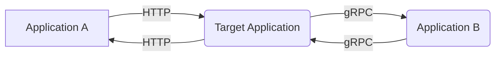

# Design Proposal: Context Propagation

## Motivation

Context propagation is a mechanism that allows tracing to be propagated across process boundaries. Usually, propagation is done by passing traceId and spanId of the current span to the next process. Those identifiers are passed as headers over the requests and responses.

The examples in this proposal describes context propagation over HTTP/gRPC formatted as [W3C Trace Context](https://www.w3.org/TR/trace-context/). However, the implementation should support other transportation methods and header formats.

## Overview

The context propagation implementation should support the following:

1. **Reading headers**: If the current transaction is a part of an existing distributed trace, the request / response should contain headers according to the chosen format.
2. **Storing the current span context**: data about the current span should be stored in an eBPF map to be used by the next process. The suggested data structure is a map from goroutine id to an object similar to [trace.SpanContext](https://pkg.go.dev/go.opentelemetry.io/otel/trace#SpanContext). The current span map should always hold the current running span. Entries can be written by one of the following:
   - Header propagator (the use case described in this document) - for remote spans created outside of the current process.
   - Automatic instrumentation - for spans created by the automatic instrumentation agent.
   - Manual instrumentation - for spans created manually by the user.

3. **Writing headers**: the implementation should get the current span from the eBPF map and propagate it to the next process by adding new headers to the request / response.

Notice that currently, the automatic instrumentation correlates spans to the same trace if they are being executed by the same goroutine. In the future we plan to implement a more robust tracking of the goroutine tree to support traces from multiple goroutines. As part of this planned change, the current implementation of context propagation will also have to be changed (different key in the current span map).

## Example walkthrough

In order to better understand how all the different pieces fit together, we will walk through an example. The example is based on the following scenario:



The target application is a simple HTTP server. For every request it receives, it sends a gRPC request to another application. The gRPC response is then sent back to the client. We assume that applications A and B are already instrumented.

### Steps

#### Step 1: Read request headers

The current HTTP server instrumentation is attached to the following function:

```go
func (mux *ServeMux) ServeHTTP(w ResponseWriter, r *Request)
```

The instrumentation is already reading fields from the `http.Request` object. Getting the headers should be a matter of tracking the `Header` field in [offsets-tracker](https://github.com/keyval-dev/offsets-tracker) and reading the values according to W3C Trace Context specification.

#### Step 2: Store the headers as current span in the SpanContext map

Update the SpanContext map with key equals to the current gorountine id and value equals to SpanContext object (traceId and spanId).

#### Step 3: Create an HTTP span

Current implementation of HTTP server probe already creates a span for the request. The span traceId and parent spanId should be set according to the values in the eBPF map.

#### Step 4: Update SpanContext map

Update the map with the newly created HTTP span as the current span.

#### Step 5: Add headers to gRPC request

In general, the context propagation implementation should attach a uprobe to a function that writes the headers to the outgoing request.
For example, in gRPC we may choose to attach a uprobe to the following function:

```go
func (l *loopyWriter) writeHeader(streamID uint32, endStream bool, hf []hpack.HeaderField, onWrite func()) error
```

The context propagation implementation will use the kernel helper function `bpf_probe_write_user()` in order to modify the `hf` array according to the current span (taken from the eBPF map). Notice that there might be a better choice for the target function, a further investigation is needed.

#### Step 6: Read headers from gRPC response

The implementation will attach a uprobe to a function that reads the headers from the incoming response. Look for headers with keys according to the W3C Trace Context specification. In gRPC example, we may choose to attach a uprobe to the following function:

```go
func decodeMetadataHeader(k, v string) (string, error)
```

This function is located at the `http_util.go` file (again, there may be a better target function, a further investigation is required).

#### Step 7: Update current span map

Similar to step 4, update the current span map with the headers from the previous step.

#### Step 8: Write headers to HTTP response

Similar to step 5, the implementation will attach a uprobe to the function that writes the headers to the response.
A possible candidate may be:

```go
func (h Header) writeSubset(w io.Writer, exclude map[string]bool, trace *httptrace.ClientTrace) error
```

## Proof of Concept

The [following application](https://github.com/edeNFed/ebpf-write-poc) is a test program that demonstrates changing go function arguments via eBPF instrumentation:

```go
func worker(str string) {
	headers := make(map[string]string)
	headers["X-Request-Id"] = str

	fmt.Printf("The Headers are: %s\n", headers)
}

func main() {
	for i := 0; i < 10; i++ {
		worker(fmt.Sprintf("request number: %d", i))
		time.Sleep(2 * time.Second)
	}
}
```

By running a [modified version](https://github.com/edeNFed/opentelemetry-go-instrumentation/tree/ebpf-write-poc) of the automatic instrumentation, we can see that the headers are set by the instrumentation successfully:

```
❯ go run main.go
The Headers are: map[X-Request-Id:request number: 0]
The Headers are: map[X-Request-Id:request number: 1]
The Headers are: map[X-Request-Id:request number: 2]
The Headers are: map[X-Request-Id:request number: 3]
The Headers are: map[X-Request-Id:request number: 4]
The Headers are: map[X-Request-Id:ebpf header value] <--- After instrumentation launched
The Headers are: map[X-Request-Id:ebpf header value]
The Headers are: map[X-Request-Id:ebpf header value]
```

## Safety Considerations

Modifying function arguments has to be done with care. The automatic instrumentation has all the data required in order to fully understand the stack state and safely modify the arguments:

- Strcutres and data fields offsets (tracked over time by version)
- Compiled go version
- CPU architecture

The process of implementing context propagation will include thorough tests to ensure that the implementation is safe.

## Future Work

- Support more propagation formats like B3 and Jaeger.
- Configure propagation via environment variables.
