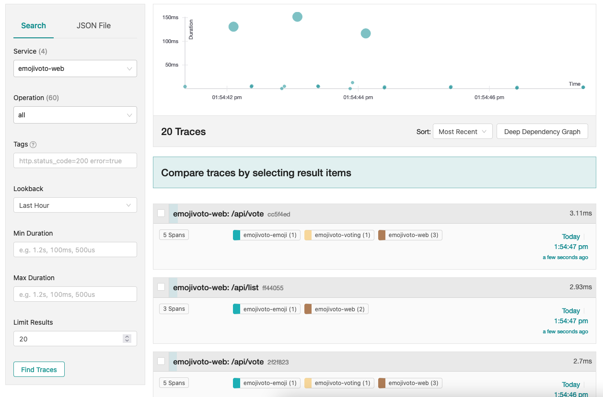

# Getting Started with Go OpenTelemetry Automatic Instrumentation

In this tutorial, we will walk through how to get started with instrumenting the [emojivoto](https://github.com/BuoyantIO/emojivoto) application, a well known microservice example running locally on a Kubernetes cluster.

## Before you begin

The following tools are required to run this tutorial:

- [Kind](https://kind.sigs.k8s.io/) to run a local Kubernetes cluster with Docker container nodes.
- [Kubernetes CLI (kubectl)](https://kubernetes.io/docs/tasks/tools/install-kubectl/) to run commands against Kubernetes clusters.

## Creating the Kubernetes cluster

Create a new local Kubernetes cluster, by running the following command:

```shell
kind create cluster
```

## Deployment

The Kubernetes cluster will run the emojivoto applications and a jaeger UI for visualizing the OpenTelemetry traces:


The different emojivoto applications are communicating via gRPC. Instrumenting those applications would allow us to view the gRPC requests between the applications.

### Deploying the emojivoto application

Run the following command:

```shell
kubectl apply -k github.com/BuoyantIO/emojivoto/kustomize/deployment
```

### Deploying Jaeger UI

Install Jaeger UI by running:

```shell
kubectl apply -f https://raw.githubusercontent.com/keyval-dev/opentelemetry-go-instrumentation/master/docs/getting-started/jaeger.yaml
```

This command installs Jaeger as a new Deployment and an additonal Service that we will use later for accessing the Jaeger UI.

In a real world application, you would probably want to send the tracing data to [OpenTelemetry collector](https://github.com/open-telemetry/opentelemetry-collector) instead of directly to Jaeger.

## Instrumentation

Download [this patch file](https://raw.githubusercontent.com/keyval-dev/opentelemetry-go-instrumentation/master/docs/getting-started/voting-patch.yaml) and apply it to the voting deployment:

```shell
kubectl patch deployment voting --patch-file voting-patch.yaml
```

Looking at the patch file will give us a better idea of how the automatic instrumentation works:

```yaml
spec:
  template:
    spec:
      shareProcessNamespace: true
      containers:
        - name: emojivoto-web-instrumentation
          image: keyval/otel-go-agent:v0.1
          env:
            - name: OTEL_TARGET_EXE
              value: /usr/local/bin/emojivoto-voting-svc
            - name: OTEL_EXPORTER_OTLP_ENDPOINT
              value: "jaeger:4317"
            - name: OTEL_SERVICE_NAME
              value: "emojivoto-voting"
          securityContext:
            runAsUser: 0
            capabilities:
              add:
                - SYS_PTRACE
            privileged: true
          volumeMounts:
            - mountPath: /sys/kernel/debug
              name: kernel-debug
      volumes:
        - name: kernel-debug
          hostPath:
            path: /sys/kernel/debug
```

The instrumentation is achieved by performing the following steps:

- Adding a sidecar container that runs the OpenTelemetry Go Instrumentation agent.
- Configuring the target executable to instrument, this is done via the `OTEL_TARGET_EXE` environment variable.
- Configuring the Jaeger exporter endpoint, this is done via the `OTEL_EXPORTER_OTLP_ENDPOINT` environment variable.
- Configuring the service name, this is done via the `OTEL_SERVICE_NAME` environment variable.
- Configuring the required permissions and security context for the instrumentation agent. Including sharing the process namespace, and mounting the kernel debugfs.

## Viewing the traces

First, port forward to the Jaeger UI:

```shell
kubectl port-forward svc/jaeger 16686:16686
```

Then, open the Jaeger UI in your browser by navigating to http://localhost:16686/

After selecting the emojivoto-voting service, you should see the following traces:


Each trace should contain data according to the OpenTelemetry specification, for example: gRPC method names, start and end timestamps, and even the goroutine id.

Notice that we did not change the emojivoto-voting application to use OpenTelemetry. This is the exact same container that we usde earlier.

## Next Steps

Instrumenting other applications is easy:

- Modify the patch file to match your application by setting the `OTEL_TARGET_EXE`,`OTEL_EXPORTER_OTLP_ENDPOINT` and `OTEL_SERVICE_NAME` environment variables.
- Apply the modified patched file:

```shell
kubectl patch deployment <deployment-name> --patch-file <modified-patch-file>
```

## Cleanup

Delete the Kubernetes cluster:

```shell
kind delete cluster
```
