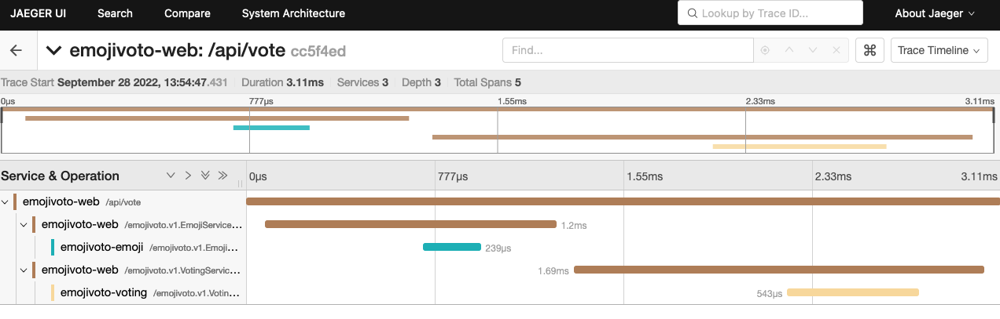
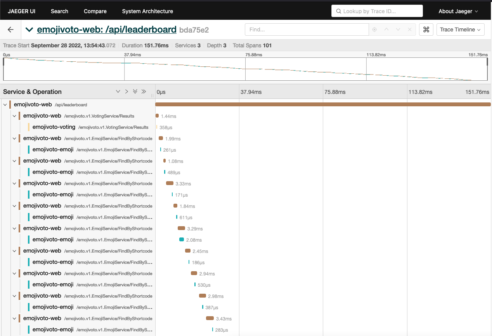

# Getting Started with Go OpenTelemetry Automatic Instrumentation

In this tutorial, we will walk through how to get started with instrumenting the [emojivoto](https://github.com/BuoyantIO/emojivoto) application, a well known microservice example running locally on a Kubernetes cluster.

## Before you begin

The following tools are required to run this tutorial:

- [Kind](https://kind.sigs.k8s.io/) to run a local Kubernetes cluster with Docker container nodes.
- [Kubernetes CLI (kubectl)](https://kubernetes.io/docs/tasks/tools/install-kubectl/) to run commands against Kubernetes clusters.

## Local build

From the root directory, build the tool as a local docker image called `otel-go-instrumentation`:

```shell
make docker-build
```

## Creating the Kubernetes cluster

Create a new local Kubernetes cluster, by running the following command:

```shell
kind create cluster
```

Load the docker image into Kind:

```shell
kind load docker-image otel-go-instrumentation
```

## Deployment

The Kubernetes cluster will run the emojivoto applications and a jaeger UI for visualizing the OpenTelemetry traces:


The different emojivoto applications are communicating via gRPC. Instrumenting those applications would allow us to view the gRPC requests between the applications.

### Deploying the emojivoto application

Run the following command:

```shell
kubectl apply -k emojivoto/
```

### Deploying Jaeger UI

Install Jaeger UI by running:

```shell
kubectl apply -f jaeger.yaml -n emojivoto
```

This command installs Jaeger as a new Deployment and an additional Service that we will use later for accessing the Jaeger UI.

In a real world application, you would probably want to send the tracing data to [OpenTelemetry collector](https://github.com/open-telemetry/opentelemetry-collector) instead of directly to Jaeger.

## Instrumentation

Apply the automatic instrumentation to the `emoji`, `voting`, and `web` applications by executing the following command:

```shell
kubectl apply -f emojivoto-instrumented.yaml -n emojivoto
```

## Perform actions on the target Application

Now all that's left to do is to perform some actions on the target application that will cause the creation of detailed distributed traces.

Port forward to the frontend service:

```shell
kubectl port-forward svc/web-svc 8080:80 -n emojivoto
```

Go to `http://localhost:8080`, and click the **view the leaderboard** button.

## Viewing the traces

First, port forward to the Jaeger UI:

```shell
kubectl port-forward svc/jaeger 16686:16686 -n emojivoto
```

Then, open the Jaeger UI in your browser by navigating to http://localhost:16686/

After selecting the `emojivoto-web` service, you should see the following traces:


Let's start with a simple trace, click on one of the `/api/vote` traces, you should see something like the following:


A few things worth noticing in this trace:

- **In process context-propagation**: We can see that the `web` application got an HTTP request (the root span) which caused two sequential gRPC requests to the `emoji` and `voting` services.
- **Cross process context-propagation**: The automatic instrumentation adds the relevant headers to gRPC / HTTP requests in order to make traces distributed across processes. In Jaeger, different applications are marked in different colors.
- **Extremely low overhead**: The entire trace took 3.1 milliseconds to complete. This show that using eBPF for instrumentation adds extremely low overhead.
- **Following OpenTelemetry Specifications**: You can click on any span in the trace to view the different attributes. All the spans produced by the automatic instrumentation follows the OpenTelemetry specification and therefore will work with any OpenTelemetry compatible backend.

Now we will view a more complex trace, search for traces for the `/api/leaderboard` endpoint.
You can quickly find them by clicking on the points with the highest duration in Jaeger's main screen.

We can get a pretty good understanding of how the leaderboard feature works by looking at this trace:

- First, the web service will perform a gRPC request to the `voting` service to get a list of the available emojis.
- Second, The web service will loop over the received list of emojis and for every item on the list it will perform a gRPC request to the `emoji` service to get the amount of votes for the current item.
- As you can see this happens sequentially, which is one of the reason the leaderboard endpoint takes about 150ms to complete.

**Notice that we did not change any application code to get those traces, we are using the exact same containers from the emojivoto project.**

## Cleanup

Delete the Kubernetes cluster:

```shell
kind delete cluster
```
