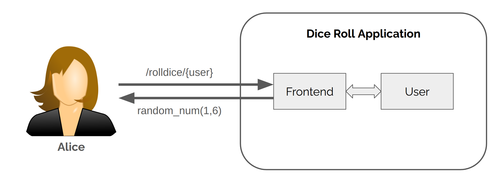
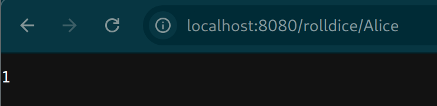
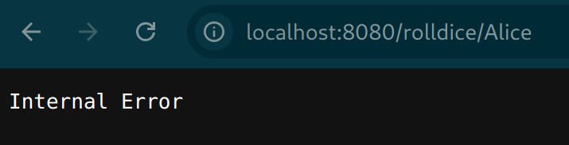
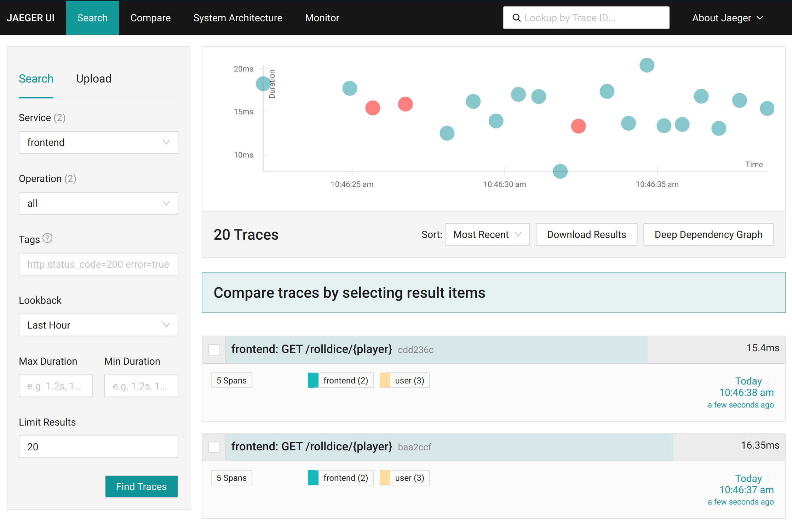
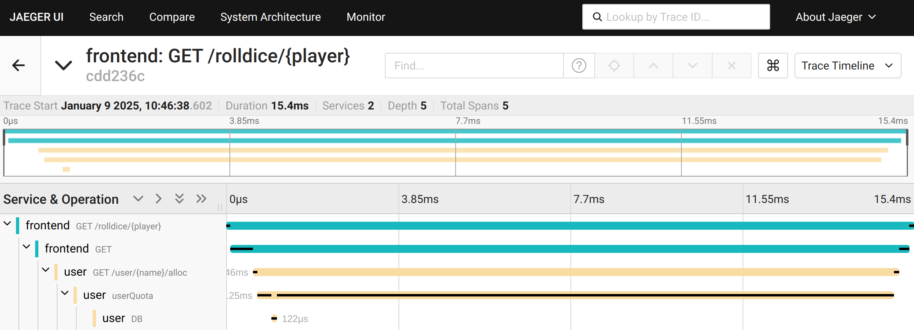
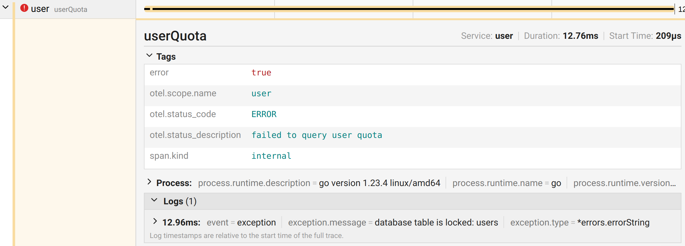

# Roll Dice Application



The `rolldice` application is a simple web application that returns a whole number between 1 and 6 when a user makes a request to `/rolldice/{player}`.

The application is made up of two services: the `frontend` and `user` services.
The `frontend` service handles the request, and the `user` service manages users accounts for the application.

## Run

Run the application using `docker-compose`.

```terminal
docker-compose up 
```

This will start the application and all telemetry related services.
You should see a log line from `go-auto-frontend-1` and `go-auto-user-1` with a message of `"instrumentation loaded successfully, starting..."`. For example,

```terminal
go-auto-user-1 | {"time":"2025-01-09T16:18:08.182081553Z","level":"INFO","source":{"function":"main.main","file":"/app/cli/main.go","line":129},"msg":"instrumentation loaded successfully, starting..."}
```

This means the application has loaded and should be ready to explore.

## Explore

With the application running, you can now [visit the `rolldice` UI](http://localhost:8080/rolldice/Alice) as the user `Alice` to start rolling dice.



Refresh the page a few times and you may notice errors are randomly returned.



You can use the observability built into the application and provided by OpenTelemetry Go auto-instrumentation to investigate these errors.

## Observability

Visit the [Jaeger UI](http://localhost:16686/) to see tracing data from the requests you just made.



### Context Propagation

Looking at one of the traces within Jaeger we can see spans from both the `frontend` and `user` services.



From this 
Both services have independently been instrumented with OpenTelemetry Go auto-instrumentation.
Even though the instrumentation for each service is run in a unique process, the trace though them is correctly shown.
Meaning, the trace context is correctly propagated by the auto-instrumentation.
It will parse and use any incoming trace information and will also add any active tracing information to outgoing requests of a service.

### Built in Instrumentation

Both services are instrumented with the OpenTelemetry Go auto-instrumentation in multiple ways.
Primarily, they are instrumented using built-in instrumentation provided by the auto-instrumentation.

Highlighted in the trace, you can see spans from the `net/http` and `database/sql` instrumentation for the Go standard library.


See the [compatibility documentation](../../COMPATIBILITY.md) for all packages with built-in instrumentation.

### Hybrid Instrumentation

In addition to built-in instrumentation, OpenTelemetry Go auto-instrumentation integrates with the OpenTelemetry API.

The `user` service has been updated to manually use the OpenTelemetry API to investigate errors coming from the problematic `userQuota` function.

```go
tracer := otel.Tracer("user")
ctx, span := tracer.Start(ctx, "userQuota")
u, err := useQuota(ctx, db, name)
if err != nil {
	span.SetStatus(codes.Error, "failed to query user quota")
	span.RecordError(err)
	span.End()
	http.Error(w, err.Error(), http.StatusInternalServerError)
	return
}
span.End()
```

This span can be seen in the Jaeger UI.



The OpenTelemetry Go auto-instrumentation automatically captures this span without the `user` service having to setup an SDK.
It is seamlessly integrated into the already active tracing being done by the auto-instrumentation.

This hybrid approach allows you to start small when manually instrumenting your applications.
As can be seen here, it can be useful in troubleshooting or just understanding behavior of your code.
