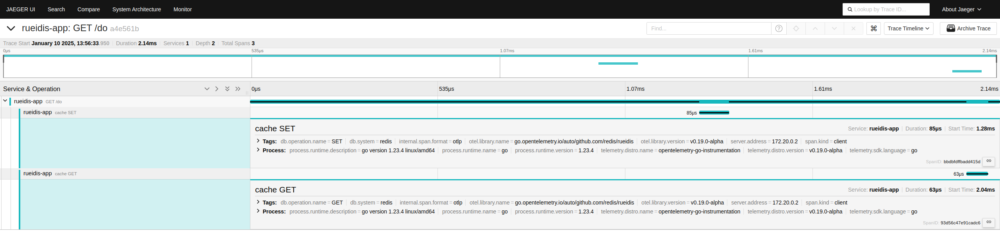

# Example of Auto instrumentation of HTTP server

Server exposes an endpoint `/do.` When we hit the endpoint, it sets a random value for `test_key` in redis and then 
retrieves it using rueidis client. 

For testing auto instrumentation, we can use the docker compose. 

To run the example, bring up the services using the command.

```
docker compose up --build
```

Now, you can hit roll dice server using the below command
```
curl localhost:8081/do
```
Every hit to the server should generate a trace that we can observe in [Jaeger UI](http://localhost:16686/)

Example trace 
