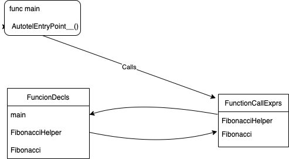

# OpenTelemetry source level automatic instrumentation

This project adds OpenTelemetry instrumentation (https://github.com/open-telemetry/opentelemetry-go) 
to Go applications by automatically modifying their source code in similar way as compiler.
It can instrument any golang project. It depends only on standard libraries and is platform agnostic.

## How to use it

In order to instrument your project you have to add following call in your entry point function, usually main
(you can look at tests directory for reference) and invoke autotel tool.

```
func main() {
    rtlib.AutotelEntryPoint__()
```

Autotel requires three parameters: command, path to project and package(s) pattern we 
would like to instrument.

```
./autotel --inject [path to your go project] [package(s) pattern]
```

Below concrete example with one of test instrumentation that is part of the project.

```
./autotel --inject ./tests/fib ./...
```

```./...``` works like wildcard in this case and it will instrument all packages in this path, but it can be invoked with
specific package as well

```
./autotel --inject ./tests/fib github.com/pdelewski/autotel/tests/fib
```

## How it works

There are few passes during execution. 
1. Search for entry point, a function definition with ```AutotelEntryPoint__()``` call.
2. Building call graph. Traversing all calls from entry point through all function definitions.
3. Injecting open telemetry calls into functions bodies. (The order of 3 and 4 has been changed and now injecting open telemetry calls pass
   is before context propagation due to fact of changing type signatures by context propagation)
4. Context propagation. Adding additional context parameter to all function declarations and function call expressions that are visible
   (it will not add context argument to call expression without having visible function declaration).




## Project Status
This project is actively maintained by Sumo Logic and is currently in it's initial days. We would love to receive your ideas, feedback & contributions.

## Contributing
We welcome issues, questions, and pull requests.

## License
This project is licensed under the terms of the Apache 2.0 open source license. Please refer to LICENSE for the full terms.